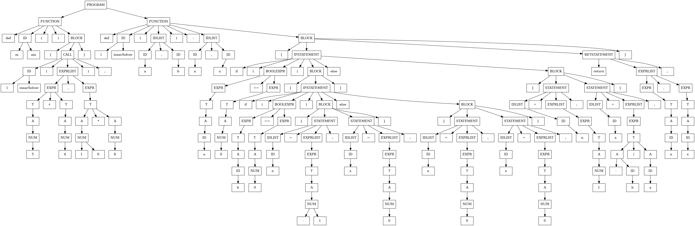

# PEGgen - C++ recursuve descent parser generator from context free formal grammar in BNF
## Usage
```
$ python3 -m peggen -h
usage: peggen [-h] [-n NAME] [-v] grammar header

C++ recursive descent parser generator from formal grammar

positional arguments:
  grammar               file with grammar
  header                file for generated header

optional arguments:
  -h, --help            show this help message and exit
  -n NAME, --name NAME  parser class name
  -v, --verbose         turn verbose mode on
```

## Example
```
$ cat lang_grammar 
PROGRAM -> (FUNCTION)+
FUNCTION -> "def" ID "(" (IDLIST)? ")" (":" IDLIST)? BLOCK
BLOCK -> "{" (CALL | STATEMENT | IFSTATEMENT | RETSTATEMENT)* "}"
IDLIST -> ID ("," ID)*
EXPR -> T (["+-"] T)*
T -> A (["*/"] A)*
A -> NUM | ["+-"]? ID | "(" EXPR ")"
NUM -> ["+-"]? ["123456789"] ["1234567890"]* | "0"
ID -> ["qwertyuiopasdfghjklzxcvbnmQWERTYUIOPASDFGHJKLZXCVBNM"] ["qwertyuiopasdfghjklzxcvbnmQWERTYUIOPASDFGHJKLZXCVBNM1234567890"]*
EXPRLIST -> EXPR ("," EXPR)*
STATEMENT -> IDLIST "=" EXPRLIST ";"
IFSTATEMENT -> "if" "(" BOOLEXPR ")" BLOCK ("else" BLOCK)?
RETSTATEMENT -> "return" (EXPRLIST)? ";"
BOOLEXPR -> EXPR (">=" | "==" | ">") EXPR
CALL -> (IDLIST "=")? ID "(" (EXPRLIST)? ")" ";"
```

```
$ cat prog.cn 
def main()  {
	linearSolver(5 + 4, 10 * 8);
}

def linearSolver(a, b) : n, x {
	if (a == 0) {
		if (b == 0) {
			n = -1;
			x = 0;
		}
		else {
			n = 0;
			x = 0;
		}
	}
	else {
		n = 1;
		x = -b / a;
	}

	return n, x;
}

```
```
$ make
python3 -m peggen lang_grammar header.hpp
g++ -fsanitize=address --std=c++17 test.cpp -o test
./test < prog.cn > prog.dot
dot -Tpng prog.dot > prog.png
```


